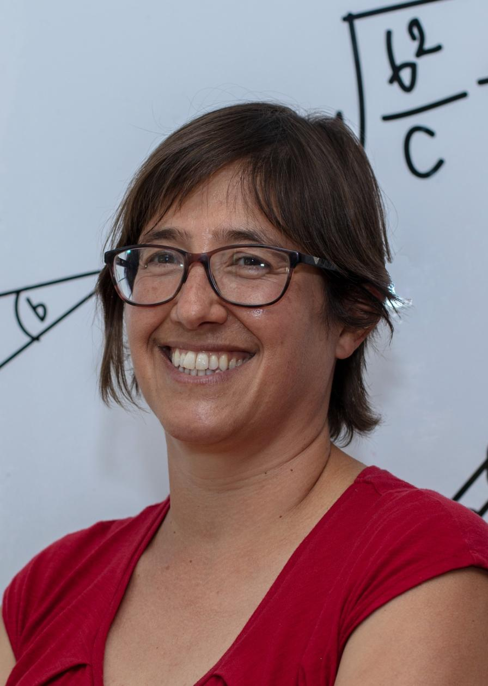

The Advanced MRI Task Force promotes the development and application of MRI methods beyond current clinical standard imaging for glioma and brain tumour research. By bringing together researchers with expertise in advanced imaging techniques, the task force supports innovation in acquisition, analysis and quantitative biomarker development.

Through networking, awareness initiatives, standardisation efforts and the development of clinical guidelines, the task force works to accelerate the adoption of advanced MRI methods in both research and clinical practice.

<h2 class="section-title">Goals</h2>

<ul>
<li> Develop a work plan together with the AI taskforce for networks, reviews and studies on treatment monitoring, tumour microenvironments, and molecular biomarkers. </li>
<li>Guideline development for clinical practice for advanced MRI biomarkers. </li>
<li>Networking for multicentric studies, cross-vendor harmonisation.</li>
<li>Organization of teaching courses together with the Education task force.</li>
<li>Liasing with the networking Task Force to foster collaboration in advanced imaging topics.</li>
<li>Dissemination of Task Force output.</li>
</ul>

<h2 class="section-title">Co-leaders</h2>

    

        
                <h3>Gilbert Hangel</h3>
            

            Medical University of Vienna • Vienna, Austria
            

    

    

        
                <h3>Rita Nunes</h3>
        

        Instituto Superior Técnico • Lisbon, Portugal
        

    

<h2 class="section-title">Contact</h2>

Interested in advanced MRI techniques, imaging biomarker development or methodological collaborations? We'd be delighted to hear from you.

<a
    class="contact-button obfuscated-email"
    data-user1="gilbert.hangel"
    data-domain1="meduniwien.ac.at"
    data-user2="ritagnunes"
    data-domain2="tecnico.ulisboa.pt">
    ✉ Get in touch
</a>
