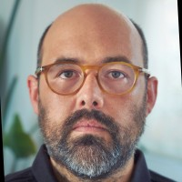

The Artificial Intelligence Task Force promotes the development, validation and application of AI methods for MRI-based glioma and brain tumour analysis. By bringing together researchers, clinicians and data scientists, the task force supports innovation in tumour characterisation, treatment monitoring and quantitative image analysis.

Through benchmarking initiatives, multi-site collaboration, data standardisation and the development of explainable AI approaches, the task force aims to accelerate the reliable and trustworthy translation of AI technologies into both research and clinical practice.

<h2 class="section-title">Goals</h2>

<ul>
<li> To be added </li>
</ul>

<h2 class="section-title">Leader</h2>

    

        
                <h3>Elies Fuster-Garcia</h3>
            

            Universitat Politècnica de València • Valencia, Spain
            

    

<h2 class="section-title">Contact</h2>

Interested in artificial intelligence, machine learning, data analysis or collaborative projects in glioma and brain tumour imaging? We welcome new ideas, expertise and collaborations.

<a
    class="contact-button obfuscated-email"
    data-user1="elfusgar"
    data-domain1="upv.es">
    ✉ Get in touch
</a>
