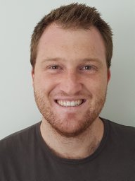

The Data Sharing and Open Science Task Force promotes the discoverability, accessibility and reuse of imaging data for glioma and brain tumour research. By bringing together researchers with an interest in open science, the task force supports initiatives that improve data sharing, transparency and collaboration across the neuro-oncology imaging community.

Through the development of shared resources, data inventories and community-driven standards, the task force aims to facilitate access to existing datasets and encourage the responsible exchange of imaging data to accelerate research and innovation.

<h2 class="section-title">Goals</h2>

<ul>
<li> To be added</li>
</ul>

<h2 class="section-title">Co-leaders</h2>

    

        
                <h3>Stephan Heunis</h3>
            

            Forschungszentrum Jülich • Jülich, Germany
            

    

    

        
                <h3>Stefanie Thust</h3>
        

        University of Nottingham • Nottingham, United Kingdom
        

    

<h2 class="section-title">Contact</h2>

Interested in open science, data sharing, imaging repositories or collaborative initiatives to improve data accessibility? We'd be delighted to hear from you.

<a
    class="contact-button obfuscated-email"
    data-user1="s.heunis"
    data-domain1="fz-juelich.de"
    data-user2="stefanie.thust"
    data-domain2="nottingham.ac.uk">
    ✉ Get in touch
</a>
