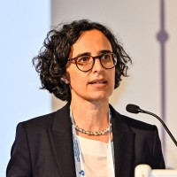
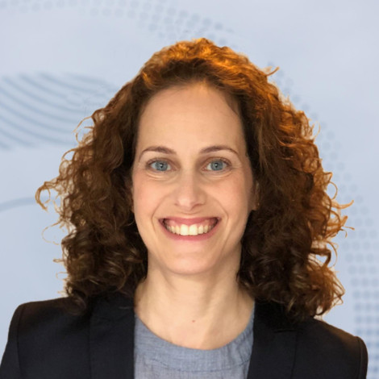

The Education Task Force promotes learning and capacity building within the GliMR community. By bringing together experts across disciplines, the task force supports the dissemination of knowledge on state-of-the-art MRI methods and advances in glioma and brain tumour imaging.

Through webinars, workshops and educational resources, the task force facilitates knowledge exchange between researchers, clinicians and the various GliMR task forces. By developing high-quality learning opportunities, the task force aims to strengthen expertise and foster collaboration across the community.

<h2 class="section-title">Goals</h2>

<ul>
<li> Promote education and training in advanced imaging methods for glioma diagnosis, treatment planning, and monitoring.</li>
<li>Facilitate knowledge exchange across disciplines, including medical engineering, data science, neuroradiology, neuro-oncology, neurosurgery, and patient advocacy.</li>
<li>Support interdisciplinary collaboration and a shared understanding of emerging imaging technologies and their clinical applications.</li>
<li>Bridge the gap between methodological developments and their implementation in clinical practice.</li>
<li>Provide educational activities and resources that support researchers, clinicians, and trainees across the glioma imaging community.</li>
</ul>

<h2 class="section-title">Co-leaders</h2>

    

        
                <h3>Teresa Nunes</h3>
            

            ULS Almada-Seixal • Lisbon, Portugal
            

    

    

        
                <h3>Yaara Erez</h3>
        

            Faculty of Engineering Bar-Ilan University • Tel Aviv, Israel
        

    

<h2 class="section-title">Contact</h2>

Interested in contributing to webinars, workshops or educational resources for the GliMR community? Get in touch and help shape future learning opportunities.

<a
    class="contact-button obfuscated-email"
    data-user1="teresasantosnunes"
    data-domain1="gmail.com"
    data-user2="Yaara.Erez"
    data-domain2="biu.ac.il">
    ✉ Get in touch
</a>
