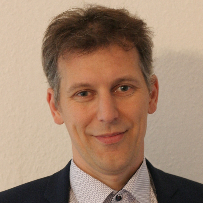

The Networking Task Force promotes collaboration between GliMR, international research initiatives, professional societies and industry partners. By building connections across the neuro-oncology imaging community, the task force helps strengthen scientific exchange and create new opportunities for collaboration.

Through networking activities, knowledge sharing and partnership development, the task force supports the dissemination of educational resources, software tools and best practices, while fostering joint funding opportunities and collaborative research initiatives.

<h2 class="section-title">Goals</h2>

<ul>
<li> To be added</li>
</ul>

<h2 class="section-title">Co-leaders</h2>

    

        
                <h3>Jan Petr</h3>
            

            Helmholtz-Zentrum Dresden-Rossendorf • Dresden, Germany
            

    

    

        
                <h3>Nico Sollmann</h3>
        

        Technische Universität München • München, Germany
        

    

<h2 class="section-title">Contact</h2>

Interested in building collaborations, connecting research communities or developing joint initiatives in neuro-oncology imaging? We'd be delighted to hear from you.

<a
    class="contact-button obfuscated-email"
    data-user1="j.petr"
    data-domain1="hzdr.de"
    data-user2="nico.sollmann"
    data-domain2="tum.de">
    ✉ Get in touch
</a>
