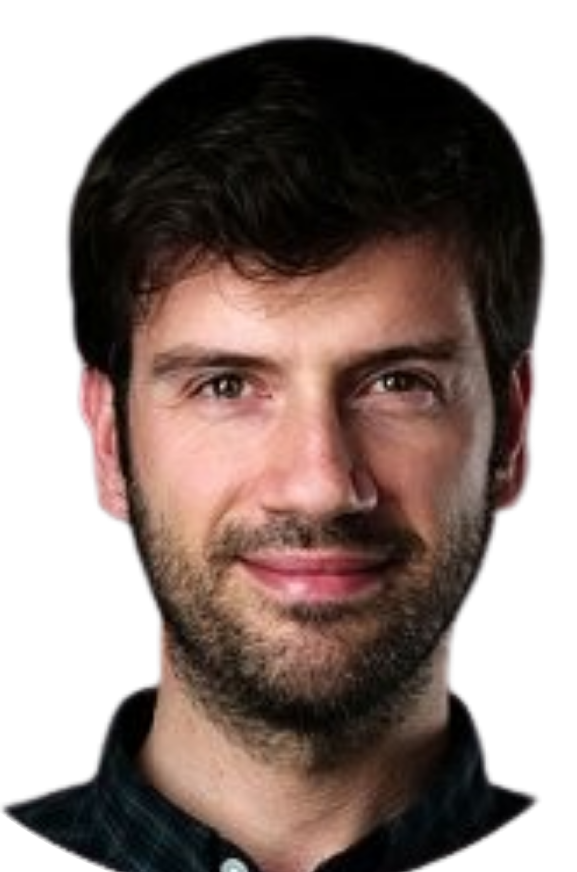
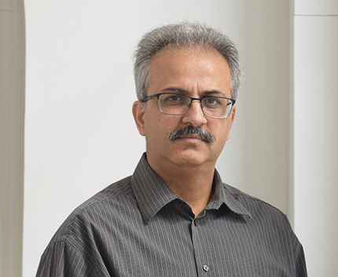

The Translational and Preclinical MRI Task Force promotes the development and application of MRI methods across both preclinical and clinical glioma research. By bringing together experts in brain tumour imaging, the task force works to ensure that imaging approaches are comparable and complementary across experimental models and human studies.

Through collaboration, education and consensus-building, the task force supports the validation of emerging MRI methods in preclinical models and their translation into clinical imaging practice. By strengthening the link between laboratory research and patient care, the task force aims to accelerate innovation in brain tumour imaging.

<h2 class="section-title">Goals</h2>

<ul>
<li> To be added</li>
</ul>

<h2 class="section-title">Co-leaders</h2>

    

        
                <h3>Rui Simões</h3>
            

            Institute for Research and Innovation in Health • Porto, Portugal
            

    

    

        
                <h3>Harish Poptani</h3>
        

            University of Liverpool • Liverpool, United Kingdom
        

    

<h2 class="section-title">Contact</h2>

Interested in preclinical imaging, translational MRI research or collaborative efforts to bridge laboratory and clinical brain tumour imaging? We'd be delighted to hear from you.

<a
    class="contact-button obfuscated-email"
    data-user1="harish.poptani"
    data-domain1="liverpool.ac.uk"
    data-user2="rvsimoes"
    data-domain2="i3s.up.pt">
    ✉ Get in touch
</a>
