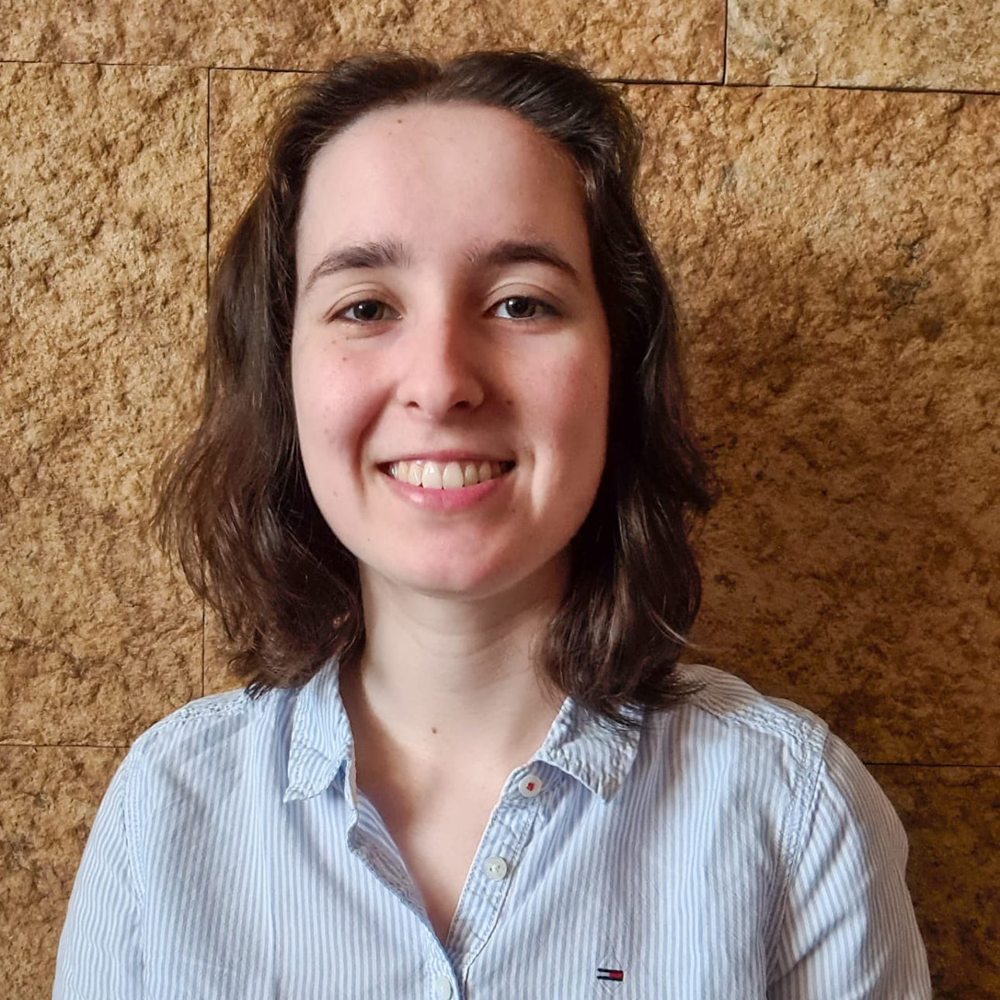
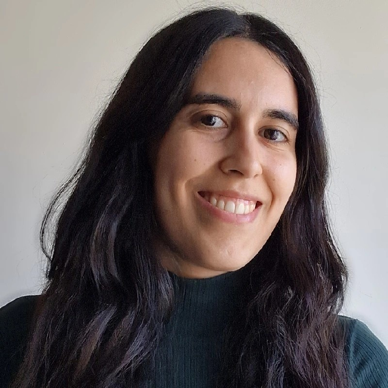

The Science Communication Task Force shares GliMR's work with scientific, clinical, and public audiences. We make the initiative's activities accessible, engaging, and easy to follow.

<h2>Co-leaders</h2>

<h3>Ana Matoso</h3>
PhD Student

Instituto Superior Técnico, Lisbon, Portugal

<h3>
Catarina Passarinho</h3>
PhD Student

Instituto Superior Técnico, Lisbon, Portugal

<h2>Goals</h2>

<ul>
<li>Share relevant content on social media about the activities of GliMR.</li>
<li>Write a quarterly newsletter  with the latest news from the GliMR community.</li>
<li>Produce, edit and publish the recordings of GliMR webinars on our <a href="https://www.youtube.com/@glimr-esmrmb" target="_blank" rel="noopener noreferrer">YouTube channel</a>.</li>
</ul>

